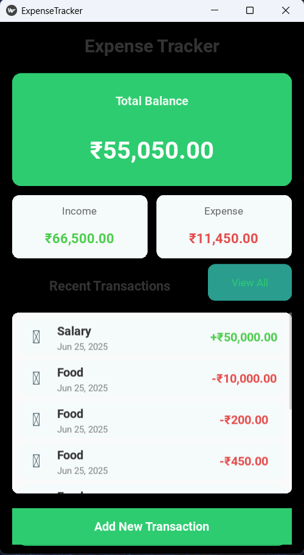

# PyBudget - Personal Expense Tracker

A simple and intuitive expense tracking application built with Python and Kivy.



*Screenshot of the PyBudget application showing the dashboard with transaction history and summary cards.*

## Features

- Track income and expenses
- Categorize transactions
- View monthly summaries
- Simple and clean user interface
- Data persistence with SQLite

## Requirements

- Python 3.7+
- Kivy 2.0.0+
- SQLAlchemy 1.4.0+

## Installation

1. Clone the repository:
   ```bash
   git clone https://github.com/yourusername/PyBudget.git
   cd PyBudget
   ```

2. Create and activate a virtual environment (recommended):
   ```bash
   python -m venv venv
   .\venv\Scripts\activate  # On Windows
   source venv/bin/activate  # On macOS/Linux
   ```

3. Install the required packages:
   ```bash
   pip install -r requirements.txt
   ```

## Usage

Run the application:
```bash
python -m expense_tracker.main
```

## Project Structure

```
PyBudget/
├── expense_tracker/
│   ├── __init__.py
│   ├── main.py
│   ├── models.py
│   └── ui/
│       ├── __init__.py
│       ├── dashboard.kv
│       ├── dashboard.py
│       ├── add_transaction.py
│       └── styles.kv
├── README.md
├── requirements.txt
└── .gitignore
```

## Contributing

Contributions are welcome! Please feel free to submit a Pull Request.

## License

This project is licensed under the MIT License - see the [LICENSE](LICENSE) file for details.
